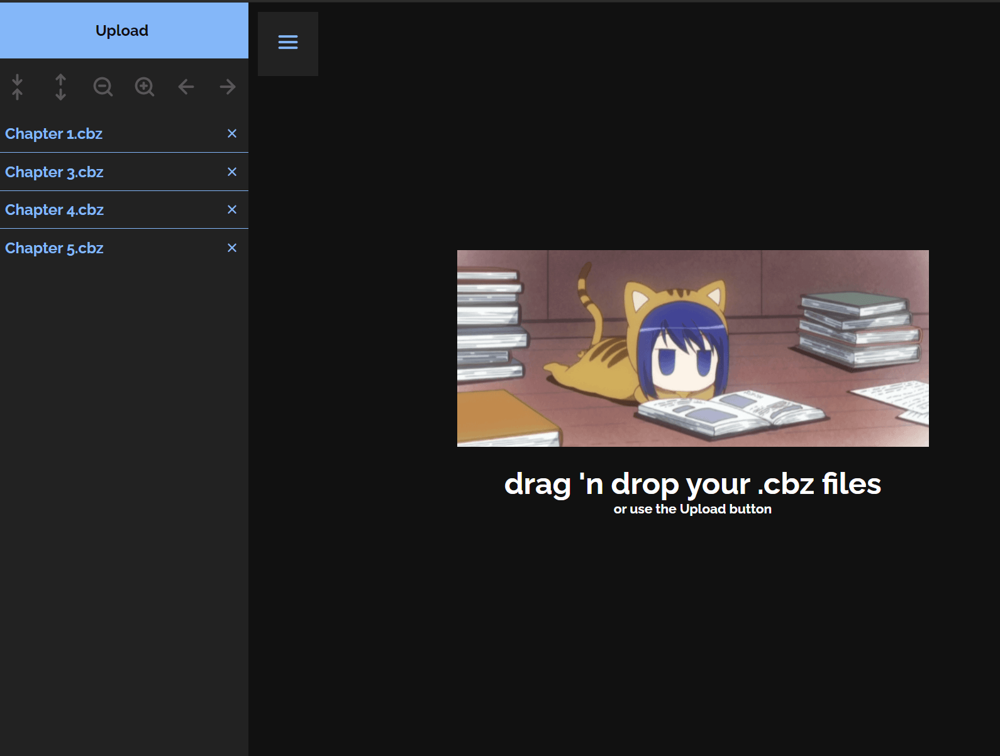
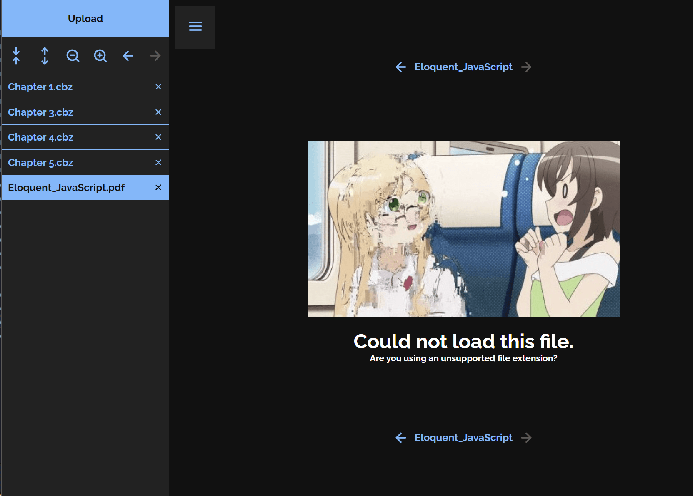

# **Ame: a simple, browser-based .cbz reader**

https://lijandrew.github.io/ame/

## &rarr; **How to use**

- Use the **Upload** button or **drag 'n drop** files into the web app. Supported file extensions: _.cbz_, _.cbr_, _.zip_, _.rar_, _.7z_, _.7zip_, _.jpg_, _.jpeg_, _.png_, _.gif_
- Uploaded files will appear in the left sidebar. Click one to display its contents in the viewer
- The sidebar has controls for zoom, margin, and previous/next file navigation
- There are also "quick navigation" buttons at the top and bottom of the viewer for convenience
- Click the hamburger menu to toggle the sidebar

## &rarr; **Latest Changes**

- "Loading" and "error" splash images
- Fixed file list scrolling
- Greatly improved usability for narrow devices
- Buttons now gray out when they are supposed to
- Drag 'n drop file upload improvements
- Production build

## &rarr; **Planned**

- PWA app ("installable" on Edge & Chrome)
- File loading bar
- ElectronJS desktop app

## &rarr; **Screenshots**

